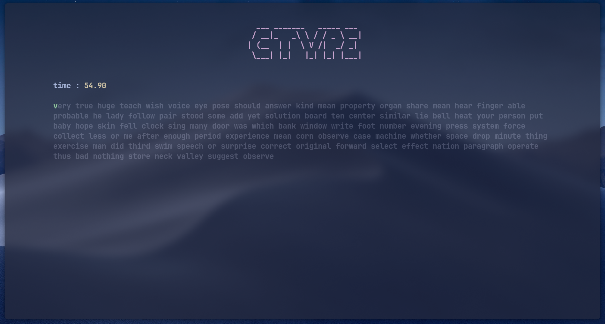

# CTyper

Minimalist terminal-based typing test written entirely in C. 


## Installation

Make sure you have a C compiler (`gcc` or `clang`) and `make` installed.

```bash
make
```

## Usage

Run the compiled binary:

```bash
./ctyper
```

### Command Line Arguments
- `-w <number>` : Set the total number of words (Default: 100, Max: 10000)
- `-t <seconds>`: Set the time limit in seconds (Default: 60)
- `-f <path>`   : Path to the custom dictionary file (Default: `top_1000_english`)

**Example:**
```bash
# 50 words, 30 seconds timer, using a custom dictionary
./ctyper -w 50 -t 30 -f dictionary
```
